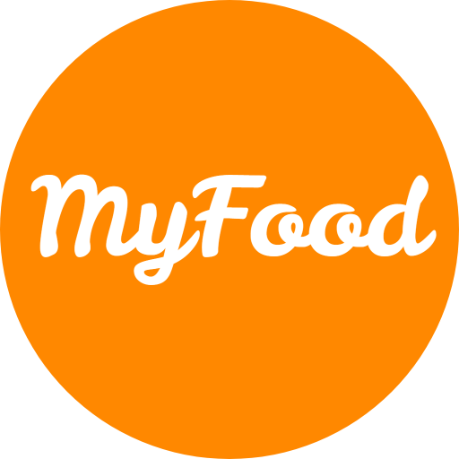
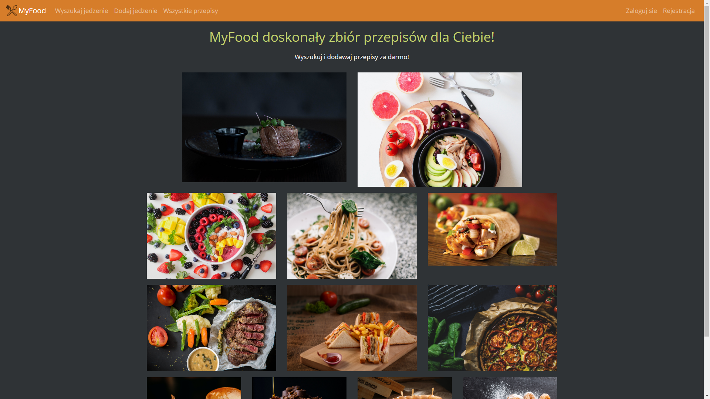
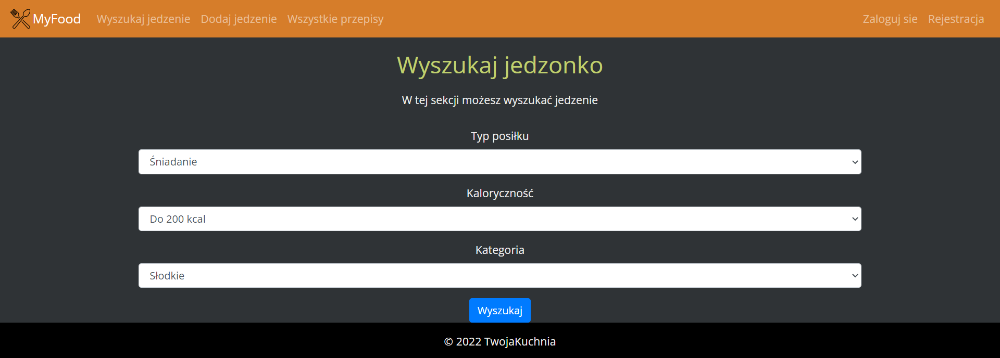
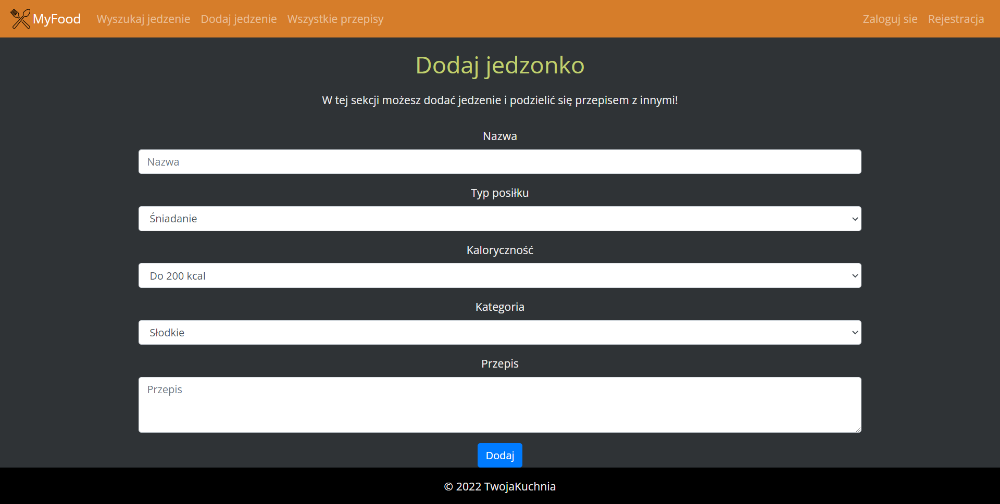
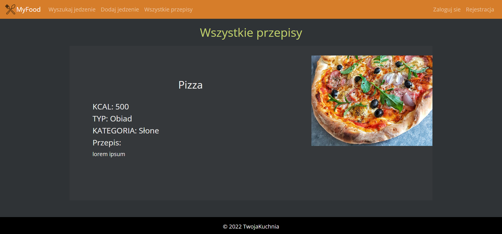

<h2 align="center">⚙️🔧 WORK IN PROGRESS 🔧⚙️</h2>

<!-- PROJECT LOGO -->
 

    
  <h3 align="center">MyFoood App</h3>
  
Idealna aplikacja gdy nie wiesz co zjeść

   
   

    

## O Projekcie
MyFood App jest projektem powstałym na potrzeby portfolio. 
Prace nad tym projektem są **ciągle w toku więc nie posiada on jeszcze wszystkich wymienionych funkcjonalności i docelowego wyglądu.**

### Opis
MyFood App jest spisem przepisów kulinarnych. To co ma wyróżniać aplikację to wyszukiwarka, która określi preferencje użytkownika, który nie do końca wie co chce zjeść. Aplikacja ma także umożliwiać dodawanie przepisów do jadłospisu na swoim profilu.

### Funkcjonalności
* Pełna responsywność strony
* Rejestracja i logowanie 
* Autoryzacja (*Użytkownik*, *Administrator*)
* Dodawanie, usuwanie, modyfikowanie przepisów
* Wyszukiwanie i wyświetlanie przepisów na podstawie preferencji użytkownika
* Dodawanie przepisów do jadłospisu użytkownika

### Stworzone za pomocą
* ![Django]
* ![BOOTSTRAP]
* ![HTML5]
* ![CSS3]

## Screenshots

[HTML5]: https://img.shields.io/badge/HTML5-E34F26?style=for-the-badge&logo=html5&logoColor=white
[CSS3]: https://img.shields.io/badge/CSS3-1572B6?style=for-the-badge&logo=css3&logoColor=white
[DJANGO]: https://img.shields.io/badge/Django-092E20?style=for-the-badge&logo=django&logoColor=white
[BOOTSTRAP]:  https://img.shields.io/badge/Bootstrap-563D7C?style=for-the-badge&logo=bootstrap&logoColor=white